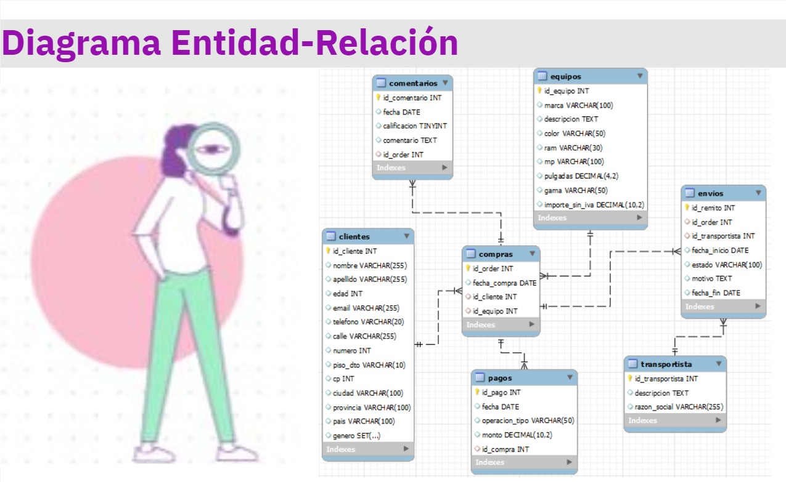

# 
Entrega de proyecto final

Alumno/a: Gisela Masanes

Comisión: 53180

Tutor: Santiago Ángel González Martín

Docente: Anderson Michel Torres

---

## Tematica del proyecto

¡Bienvenidos al emocionante mundo de las compras en línea de teléfonos celulares! En un mundo cada vez más conectado, la conveniencia de adquirir productos desde la comodidad de nuestros hogares ha revolucionado la forma en que compramos. En respuesta a esta creciente demanda, nos complace presentarles nuestra tienda en línea, dedicada a ofrecer una amplia variedad de teléfonos celulares de última generación.

## Misión

El objetivo principal de nuestro proyecto es ofrecer a nuestros clientes una experiencia de compra en línea excepcional y sin complicaciones. Nos esforzamos por proporcionar una amplia selección de teléfonos celulares de alta calidad, junto con un sitio web fácil de usar que permita a nuestros clientes navegar, comparar y comprar sus dispositivos deseados con total confianza y seguridad.

## Modelo de negocio

Nuestro modelo de negocio se centra en ofrecer una amplia selección de productos de calidad, una experiencia de compra sin complicaciones y un excelente servicio al cliente para satisfacer las necesidades de nuestros clientes y construir relaciones duraderas con ellos.

## Diagrama entidad relacion (DER)

## Listado de tablas y descripción 

| #   | Nombre_tabla | Columna                                     | Descripción_breve                         | Tipo de dato       | Índice(es) | Valor_null | Auto_incremento |
|-----|--------------|--------------------------------------------|-----------------------------------------------------|--------------------|-------------|------------|-----------------|
| 1   | Transportista| id_transportista                           | Identificador del transportista                     | INT                | PRIMARY KEY | No         | Sí              |
|     |              | descripcion                                | Descripción de la empresa de transporte             | TEXT               | -           | Sí         | -               |
|     |              | razon_social                               | Razón social de la empresa de transporte            | VARCHAR(255)       | -           | Sí         | -               |
| 2   | Equipos      | id_equipo                                  | Identificador del equipo                            | INT                | PRIMARY KEY | No         | Sí              |
|     |              | marca                                      | Marca del equipo                                   | VARCHAR(100)       | -           | Sí         | -               |
|     |              | descripcion                                | Descripción del equipo                              | TEXT               | -           | Sí         | -               |
|     |              | color                                      | Color del equipo                                   | VARCHAR(50)        | Sí          |             | No              |
|     |              | ram                                        | Capacidad de RAM                                   | VARCHAR(30)        | -           | Sí         | -               |
|     |              | mp                                         | Megapíxeles de la cámara                           | VARCHAR(100)       | -           | Sí         | -               |
|     |              | pulgadas                                   | Tamaño de pantalla (pulgadas)                      | DECIMAL(4, 2)      | -           | Sí         | -               |
|     |              | gama                                       | Gama del equipo                                    | VARCHAR(50)        | -           | Sí         | -               |
|     |              | importe_sin_iva                            | Valor del equipo                                   | DECIMAL(10, 2)     | Sí          |             | No              |
| 3   | Clientes     | id_cliente                                 | Identificador del cliente                          | INT                | PRIMARY KEY | No         | Sí              |
|     |              | nombre                                     | Nombre del cliente                                 | VARCHAR(255)       | -           | Sí         | -               |
|     |              | apellido                                   | Apellido del cliente                               | VARCHAR(255)       | -           | Sí         | -               |
|     |              | edad                                       | Edad del cliente                                   | INT                | -           | Sí         | -               |
|     |              | email                                      | Correo electrónico del cliente                     | VARCHAR(255)       | UNIQUE      | Sí         | -               |
|     |              | telefono                                   | Teléfono del cliente                               | VARCHAR(20)        | -           | Sí         | -               |
|     |              | calle                                      | Calle de residencia del cliente                    | VARCHAR(255)       | -           | Sí         | -               |
|     |              | numero                                     | Número de residencia del cliente                   | INT                | -           | Sí         | -               |
|     |              | piso_dto                                   | Piso o departamento de residencia del cliente      | VARCHAR(10)        | -           | Sí         | -               |
|     |              | cp                                         | Código postal del cliente                          | INT                | -           | Sí         | -               |
|     |              | ciudad                                     | Ciudad de residencia del cliente                   | VARCHAR(100)       | -           | Sí         | -               |
|     |              | provincia                                  | Provincia de residencia del cliente                | VARCHAR(100)       | -           | Sí         | -               |
|     |              | pais                                       | País de residencia del cliente                     | VARCHAR(100)       | -           | Sí         | -               |
|     |              | genero                                     | Género del cliente "Femenino","Masculino","X"      | SET                | -           | Sí         | -               |
| 4   | Compras      | id_order                                   | Identificador de la orden                          | INT                | PRIMARY KEY | No         | Sí              |
|     |              | Fecha_compra                               | Fecha de la compra                                 | DATE               | -           | Sí         | -               |
|     |              | id_cliente                                 | Identificador del cliente/FOREIGN KEY DE CLIENTES  | INT                | FOREIGN KEY | No         | Sí              |
|     |              | id_equipo                                  | Identificador del equipo comprado/FOREIGN KEY DE EQUIPOS| INT            | FOREIGN KEY | No         | Sí              |
| 5   | Comentarios  | id_comentario                              | Identificador del comentario                       | INT                | PRIMARY KEY | No         | Sí              |
|     |              | fecha                                      | Fecha del comentario                               | DATE               | -           | Sí         | -               |
|     |              | calificacion                               | Calificación del comentario (de 0 a 10)            | TINYINT UNSIGNED   | -           | Sí         | -               |
|     |              | comentario                                 | Texto del comentario                               | TEXT               | -           | Sí         | -               |
|     |              | id_order                                   | Identificador de la orden asociada al comentario/ FOREIGN KEY DE COMPRAS| INT| FOREIGN KEY | No         | Sí              |
| 6   | Envios       | id_remito                                  | Identificador del envío                            | INT                | PRIMARY KEY | No         | Sí              |
|     |              | id_order                                   | Identificador de la orden asociada al envío/ FOREIGN KEY DE COMPRAS| INT| FOREIGN KEY | No         | Sí              |
|     |              | id_transportista                           | Identificador del transportista asociado al envío/ FOREIGN KEY DE TRANSPORTISTAS| INT| FOREIGN KEY | No         | Sí              |
|     |              | fecha_inicio                               | Fecha de inicio del envío                          | DATE               | -           | Sí         | -               |
|     |              | estado                                     | Estado del envío                                   | VARCHAR(100)       | -           | Sí         | -               |
|     |              | motivo                                     | Motivo del envío                                   | TEXT               | -           | Sí         | -               |
|     |              | fecha_fin                                  | Fecha de finalización del envío                    | DATE               | -           | Sí         | -               |
| 7   | Pagos        | id_pago                                    | Identificador del pago                             | INT                | PRIMARY KEY | No         | Sí              |
|     |              | fecha                                      | Fecha del pago                                     | DATE               | -           | Sí         | -               |
|     |              | operacion_tipo                             | Tipo de operación del pago                         | VARCHAR(50)        | -           | Sí         |

## Estructura e ingesta de datos

## Objetos de la base de datos

## Roles y permisos

## Back up de la base de datos

## Herramientas y tecnologias usadas

    
  

    
  

    
  

    
  

    
  

    
  

