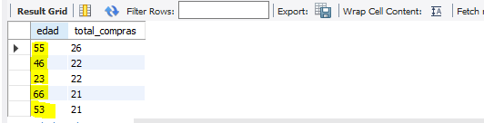
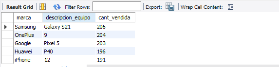
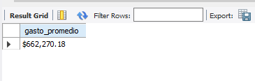
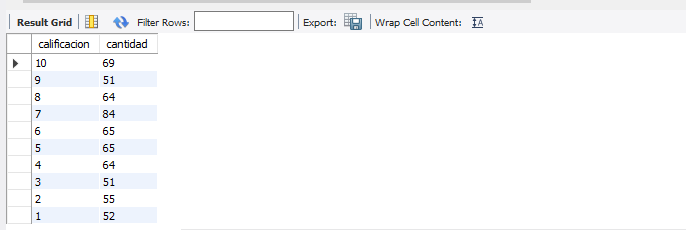
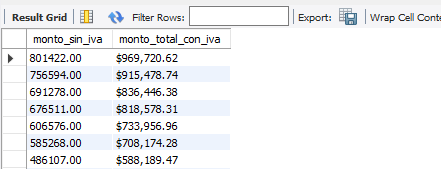

#
Entrega de proyecto final

Alumno/a: Gisela Masanes (grosa)

Comisión: 53180

Tutor: Santiago Ángel González Martín

Docente: Anderson Michel Torres

---

## Indice

 1) [Temática del Proyecto](#temática-del-proyecto)
 2. [Modelo de Negocio](#modelo-de-negocio)
 3) [Diagrama Entidad-Relación](#diagrama-entidad-relación)
 4) [Listado de Tablas y Descripción](#listado-de-tablas-y-descripción)
 5) [Ingesta de datos](#ingesta-de-datos)
 6) [Objetos de la Base de Datos](#objetos-de-la-base-de-datos)
   - [Documentación de Funciones](#documentación-de-funciones)
   - [Documentación de Triggers](#documentación-de-triggers)
   - [Documentación de Procedimientos Almacenados](#documentación-de-procedimientos-almacenados)
   - [Documentación de Vistas](#documentación-de-vistas)
   - [Roles, Permisos y Usuarios](#roles-permisos-y-usuarios)
 - [Backup de la Base de Datos](#backup-de-la-base-de-datos)
 - [Herramientas y Tecnologías Usadas](#herramientas-y-tecnologías-usadas)
 - [Instrucciones para Levantar el Proyecto en CodeSpaces GitHub](#instrucciones-para-levantar-el-proyecto-en-codespaces-github)
 - [Formato de Entrega](#formato-de-entrega)

1) ## Temática del proyecto

¡Bienvenidos al emocionante mundo de las compras en línea de teléfonos celulares!. En un mundo cada vez más conectado, la conveniencia de adquirir productos desde la comodidad de nuestros hogares ha revolucionado la forma en que compramos. En respuesta a esta creciente demanda, nos complace presentarles nuestra tienda en línea, dedicada a ofrecer una amplia variedad de teléfonos celulares de última generación.

2) ## Modelo de Negocio
Visión General:
SmartHYou Online es una plataforma de comercio electrónico especializada en la venta de dispositivos tecnológicos, con un énfasis particular en teléfonos móviles de alta gama. Nuestra misión es ofrecer a los consumidores la última tecnología en dispositivos móviles con un servicio de atención al cliente de primer nivel y un sistema de logística eficiente.

[<- volver al índice](#indice)

3) ## #diagrama-entidad-relación

[<- volver al índice](#indice)

4) ## Listado de tablas y descripción 

| #   | Nombre_tabla | Columna                                     | Descripción_breve                         | Tipo de dato       | Índice(es) | Valor_null | Auto_incremento |
|-----|--------------|--------------------------------------------|-----------------------------------------------------|--------------------|-------------|------------|-----------------|
| 1   | Transportista| id_transportista                           | Identificador del transportista                     | INT                | PRIMARY KEY | No         | Sí              |
|     |              | descripcion                                | Descripción de la empresa de transporte             | TEXT               | -           | Sí         | -               |
|     |              | razon_social                               | Razón social de la empresa de transporte            | VARCHAR(255)       | -           | Sí         | -               |
| 2   | Equipos      | id_equipo                                  | Identificador del equipo                            | INT                | PRIMARY KEY | No         | Sí              |
|     |              | marca                                      | Marca del equipo                                   | VARCHAR(100)       | -           | Sí         | -               |
|     |              | descripcion                                | Descripción del equipo                              | TEXT               | -           | Sí         | -               |
|     |              | color                                      | Color del equipo                                   | VARCHAR(50)        | Sí          |             | No              |
|     |              | ram                                        | Capacidad de RAM                                   | VARCHAR(30)        | -           | Sí         | -               |
|     |              | mp                                         | Megapíxeles de la cámara                           | VARCHAR(100)       | -           | Sí         | -               |
|     |              | pulgadas                                   | Tamaño de pantalla (pulgadas)                      | DECIMAL(4, 2)      | -           | Sí         | -               |
|     |              | gama                                       | Gama del equipo                                    | VARCHAR(50)        | -           | Sí         | -               |
|     |              | importe_sin_iva                            | Valor del equipo                                   | DECIMAL(10, 2)     | Sí          |             | No              |
| 3   | Clientes     | id_cliente                                 | Identificador del cliente                          | INT                | PRIMARY KEY | No         | Sí              |
|     |              | nombre                                     | Nombre del cliente                                 | VARCHAR(255)       | -           | Sí         | -               |
|     |              | apellido                                   | Apellido del cliente                               | VARCHAR(255)       | -           | Sí         | -               |
|     |              | edad                                       | Edad del cliente                                   | INT                | -           | Sí         | -               |
|     |              | email                                      | Correo electrónico del cliente                     | VARCHAR(255)       | UNIQUE      | Sí         | -               |
|     |              | telefono                                   | Teléfono del cliente                               | VARCHAR(20)        | -           | Sí         | -               |
|     |              | calle                                      | Calle de residencia del cliente                    | VARCHAR(255)       | -           | Sí         | -               |
|     |              | numero                                     | Número de residencia del cliente                   | INT                | -           | Sí         | -               |
|     |              | piso_dto                                   | Piso o departamento de residencia del cliente      | VARCHAR(10)        | -           | Sí         | -               |
|     |              | cp                                         | Código postal del cliente                          | INT                | -           | Sí         | -               |
|     |              | ciudad                                     | Ciudad de residencia del cliente                   | VARCHAR(100)       | -           | Sí         | -               |
|     |              | provincia                                  | Provincia de residencia del cliente                | VARCHAR(100)       | -           | Sí         | -               |
|     |              | pais                                       | País de residencia del cliente                     | VARCHAR(100)       | -           | Sí         | -               |
|     |              | genero                                     | Género del cliente "Femenino","Masculino","X"      | SET                | -           | Sí         | -               |
| 4   | Compras      | id_order                                   | Identificador de la orden                          | INT                | PRIMARY KEY | No         | Sí              |
|     |              | Fecha_compra                               | Fecha de la compra                                 | DATE               | -           | Sí         | -               |
|     |              | id_cliente                                 | Identificador del cliente/FOREIGN KEY DE CLIENTES  | INT                | FOREIGN KEY | No         | Sí              |
|     |              | id_equipo                                  | Identificador del equipo comprado/FOREIGN KEY DE EQUIPOS| INT            | FOREIGN KEY | No         | Sí              |
| 5   | Comentarios  | id_comentario                              | Identificador del comentario                       | INT                | PRIMARY KEY | No         | Sí              |
|     |              | fecha                                      | Fecha del comentario                               | DATE               | -           | Sí         | -               |
|     |              | calificacion                               | Calificación del comentario (de 0 a 10)            | TINYINT UNSIGNED   | -           | Sí         | -               |
|     |              | comentario                                 | Texto del comentario                               | TEXT               | -           | Sí         | -               |
|     |              | id_order                                   | Identificador de la orden asociada al comentario/ FOREIGN KEY DE COMPRAS| INT| FOREIGN KEY | No         | Sí              |
| 6   | Envios       | id_remito                                  | Identificador del envío                            | INT                | PRIMARY KEY | No         | Sí              |
|     |              | id_order                                   | Identificador de la orden asociada al envío/ FOREIGN KEY DE COMPRAS| INT| FOREIGN KEY | No         | Sí              |
|     |              | id_transportista                           | Identificador del transportista asociado al envío/ FOREIGN KEY DE TRANSPORTISTAS| INT| FOREIGN KEY | No         | Sí              |
|     |              | fecha_inicio                               | Fecha de inicio del envío                          | DATE               | -           | Sí         | -               |
|     |              | estado                                     | Estado del envío                                   | VARCHAR(100)       | -           | Sí         | -               |
|     |              | motivo                                     | Motivo del envío                                   | TEXT               | -           | Sí         | -               |
|     |              | fecha_fin                                  | Fecha de finalización del envío                    | DATE               | -           | Sí         | -               |
| 7   | Pagos        | id_pago                                    | Identificador del pago                             | INT                | PRIMARY KEY | No         | Sí              |
|     |              | fecha                                      | Fecha del pago                                     | DATE               | -           | Sí         | -               |
|     |              | operacion_tipo                             | Tipo de operación del pago                         | VARCHAR(50)        | -           | Sí         |

[<- volver al índice](#indice)

5) ## Ingesta de datos

El diseño de creación y definición de la base de datos se encuentra en el archivo database_structure.sql, situado en la carpeta structure.

La mayoría de las operaciones de carga de datos se llevan a cabo mediante el archivo population.sql.

6) ## Objetos de la base de datos

* ## Documentacion de Vistas
### Vista 1: Compras por género
| #   | View_Nombre               | DESCRIPCIÓN                                                                       | TABLAS COMPROMETIDAS |
|-----|---------------------------|-----------------------------------------------------------------------------------|----------------------|
| 1   | vw_compras_por_genero     | Muestra el total de compras por género y el porcentaje que representan del total. | compras, clientes    |

**Muestra del resultado de la consulta:**

---

### Vista 2: Top_Five de edades que más compran en Smartyou

| #   | View_Nombre               | DESCRIPCIÓN                                                           | TABLAS COMPROMETIDAS |
|-----|---------------------------|-----------------------------------------------------------------------|----------------------|
| 2   | vw_edades_clientes        | Indica el total de compras agrupadas por edad de los clientes.        | compras, clientes    |

**Muestra del resultado de la consulta:**

### Vista 3: Equipos más vendidos

| #   | View_Nombre               | DESCRIPCIÓN                                                                | TABLAS COMPROMETIDAS |
|-----|---------------------------|----------------------------------------------------------------------------|----------------------|
| 3   | vw_equipos_mas_vendidos   | Lista las marcas y descripciones de los equipos más vendidos, limitados a los top 5. | compras, equipos     |

**Muestra del resultado de la consulta:**

### Vista 4: Gasto promedio de las compras de los clientes

| #   | View_Nombre               | DESCRIPCIÓN                                                                                                 | TABLAS COMPROMETIDAS |
|-----|---------------------------|-------------------------------------------------------------------------------------------------------------|----------------------|
| 4   | vw_promedio_gasto_clientes | Calcula el monto promedio que los clientes gastan en la tienda online para comprar un celular.              | pagos                |

**Muestra del resultado de la consulta:**

### Vista 5: Agrupar calificaciones de los clientes

| #   | View_Nombre               | DESCRIPCIÓN                                                                        | TABLAS COMPROMETIDAS |
|-----|---------------------------|------------------------------------------------------------------------------------|----------------------|
| 5   | vw_calificaciones_clientes | Agrupa y cuenta las calificaciones dadas por los clientes en sus comentarios.      | comentarios          |

**Muestra del resultado de la consulta:**

* ## Documentación de Funciones
### Función 1: Monto con IVA

| # | Function_Nombre     | Descripción                                                      | Tablas Comprometidas |
|---|---------------------|------------------------------------------------------------------|----------------------|
| 1 | fn_monto_con_iva    | Devuelve el monto con un IVA del 21%                             | pagos              |

**Muestra del resultado de la consulta:**

**Descripción:** Esta función calcula el monto total incluyendo un impuesto del 21% (IVA).

**Parámetros:**

***mesa_id:** 

**Retorno:**

**TRUE**                                    **FALSE** 

**Ejemplo de uso:**

### Función: demora de tiempo de entrega a cliente
**Descripción:** Esta función calcula la demora de entrega de un envío en días, tomando en cuenta la diferencia entre la fecha de inicio y la fecha de fin.

**Parámetros:**

***mesa_id:** 

**Retorno:**

**TRUE**                                    **FALSE** 

**Ejemplo de uso:**

### Función: Nombre del cliente
**Descripción:** Esta función me devuelve el nombre completo de un cliente (nombre, apellido y edad) dado su ID.

**Parámetros:**

***mesa_id:** 

**Retorno:**

**TRUE**                                    **FALSE** 

**Ejemplo de uso:**

## Documentación de Triggers

## Documentación stored_procedure

## Roles y permisos

`./objects/roles_users.sql`

Se genera tres roles:

## Back up de la base de datos

Se puede generar un comando en el archivo `make backup` que me permite ejecutar un backup de manera manual.

## Herramientas y tecnologías usadas

    
    
    

    
    
    

    
    
    

